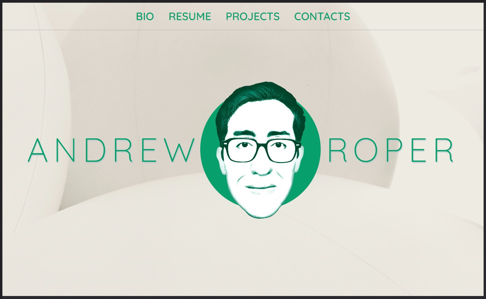
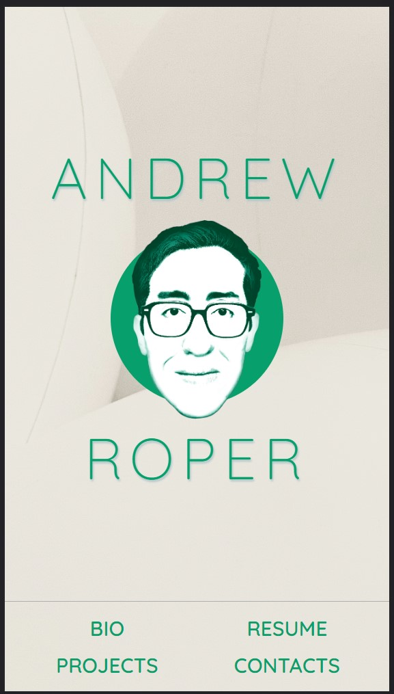

# Challenge 02 - Professional Portfolio Beginnings

## Description

This web application is designed to highlight myself, my work experiences, and the projects and assignments that I will be accomplishing in this class. With this being accessible via online connection, future employers might use this as reference when I apply to work for them or for me to revisit past projects. Due to just starting out in this Bootcamp, the nature of this specific web application is currently incomplete and will be added to as I progress in this program. This will result in projects being added to the Project section of the web application as well as refinements in the appearance and user interactions.

## Installation

There is no Installation involved on the users side to utilize this webpage; just visit [https://hello-andyjoe.github.io/Challenge-2](https://hello-andyjoe.github.io/Challenge-2)

## Usage

To use this site, it's largely a matter of just viewing this web application through your preferred web browser. This web application is designed to be responsive to the size of the viewer's web browsing window. Elements will resize and shift based to better suit the size of the web browsing window and can be observed when viewing on a large desktop monitor compared to a mobile device such as a smartphone. Additionally, it can be observed by using the Development Tools on Google Chrome or another web browser and resizing the window there. A media query for the aspect ratio for the  image and h2 elements in hero div and will display those elements differently depending on if the browser is in a widescreen ratio compared to a 1/1 or portrait ratio.

## Credits

Original CSS file 'reset.css' provided by ASU Bootcamp Course.

Quicksand font provided by Google Fonts and designed by Andrew Paglinawan 
: Link to [Quicksand Font](https://fonts.google.com/specimen/Quicksand?category=Sans+Serif)

The following links were useful for certain aspects of the design:

[W3 School How To Position Text Over an Image](https://www.w3schools.com/howto/howto_css_image_text.asp)

[mdn webdocs aspect-ratio](https://developer.mozilla.org/en-US/docs/Web/CSS/@media/aspect-ratio)

## License

MIT License

Copyright (c) 2023 Hello-AndyJoe

Permission is hereby granted, free of charge, to any person obtaining a copy
of this software and associated documentation files (the "Software"), to deal
in the Software without restriction, including without limitation the rights
to use, copy, modify, merge, publish, distribute, sublicense, and/or sell
copies of the Software, and to permit persons to whom the Software is
furnished to do so, subject to the following conditions:

The above copyright notice and this permission notice shall be included in all
copies or substantial portions of the Software.

THE SOFTWARE IS PROVIDED "AS IS", WITHOUT WARRANTY OF ANY KIND, EXPRESS OR
IMPLIED, INCLUDING BUT NOT LIMITED TO THE WARRANTIES OF MERCHANTABILITY,
FITNESS FOR A PARTICULAR PURPOSE AND NONINFRINGEMENT. IN NO EVENT SHALL THE
AUTHORS OR COPYRIGHT HOLDERS BE LIABLE FOR ANY CLAIM, DAMAGES OR OTHER
LIABILITY, WHETHER IN AN ACTION OF CONTRACT, TORT OR OTHERWISE, ARISING FROM,
OUT OF OR IN CONNECTION WITH THE SOFTWARE OR THE USE OR OTHER DEALINGS IN THE
SOFTWARE.